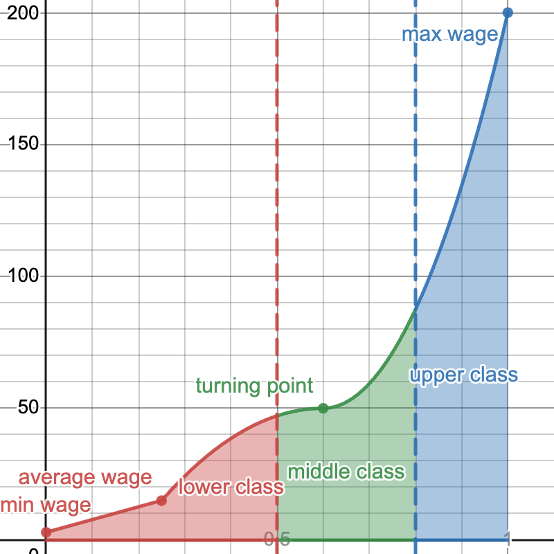

# Good Feeling Politics
**Background:** 1815-1824 is Era of Good Feelings when US was single party state with only Democratic-Republican party viable in politics.
**Premise:** Over the 10 year Era of Good Feelings, players propose legislature and rally popular support. After those 10 years, hold an election between them including Andrew Jackson and John Quincy Adams. If a player wins the popular vote, they win the game. If Jackson or JQA wins the popular vote, everybody loses.

## Topics Covered:
* Era of Good Feelings: Game takes place during this era which influences much of the theming, plot, rules. Deals with Andrew Jackson, John Quincy Adams, and the role of the popular vote.
* Stratification: Politicians supporting rich people receive more money to push their campaigns and propose legislation. Widens the gap between rich and poor. Black politicians can run for president but are significantly disadvantaged compared to their white counterparts. Prevents black people from making the legislation to equalize power. Black CPUs also can’t vote.
* Legal Realism: To win in this game, players must propose legislation not based on the idea of the perfect law but to appeal to the ideologies of the population and the voters. Fickleness of politicians and their policy based on popular support.
* Federalists vs Democratic-Republicans: Federalists favor legislation that benefits the upper class in the simulation. Democratic-Republicans favor land expansion and the middle class.

## Gameplay:
Jackbox style party game
* 10 timed rounds starting from 2m and decreasing to 45s by last round
    * Andrew Jackson and John Quincy Adamsbegins to run for president in 1824
* Players can make N moves per round where N is determined by the wealth of their supporters
* Proposals:
    * $1000: Take N acres of native land
    * $1000: Raise/lower tax by N%: Whiskey, Cotton, Alcohol, Sugar
    * $500: Engage in 1m debate against target which can reduce target popularity and increase player popularity based on the other players’ voting.

## Mechanics:
10,000 Population of CPUs
* Individual CPU Stats (all normalized):
    * Race: Black-White
        * Start with a 19:81 ratio (reflects 1810 populations)[^1]
    * Ideals: Federalist-DemocraticRepublican
        * Starts with a 47.6:52.4 ratio (reflects 1812 election)[^2]
    * Occupation: Farmer-FarmOwner-Investor-Speculator
    * Income: [https://www.desmos.com/calculator/mht4qvfesc](https://www.desmos.com/calculator/mht4qvfesc)
        * Starts with an average income of $15 (average through decade of 1810s)[^3]
        * 20% of the population starts off with normalized income >= 0.8 ($87-$300 per month). This is the lower class. 80% starts off with normalized income &lt;= 0.5 ($3-$47 per month). This is the upper class.
        * 
        
* End of every round, each mature CPU is paired with the most similar other mature CPU by stats. They have a kid whose stats are the average between the parents’ and the population average. CPUs mature after their parents die and CPUs die after 2 rounds. Population doubles and halves every 2 rounds.
    * <table>
        <tr><td>Mating Weights</td><td></td></tr>
        <tr><td>Ideals</td><td>3</td></tr>
        <tr><td>Occupation</td><td>1</td></tr>
        <tr><td>Income</td><td>10</td></tr>
        <tr><td>Race</td><td>5</td></tr>
    </table>
* Each CPU gives N% to their most matched candidate where N is determined by the match score. CPUs only give if upper middle class or above.

## Notes
[^1]: Buntin, Lawrence J. and U.S. Bureau Of The Census. “Historical Statistics of the United States: Colonial Times to 1970.” _Journal of Marketing Research_ 13, no. 4 (November 1976): 447.[ https://doi.org/10.2307/3151041](https://doi.org/10.2307/3151041).

[^2]: “A New Nation Votes.” Accessed December 15, 2023.[ https://elections.lib.tufts.edu/?f%5Belection_type_sim%5D%5B%5D=General&f%5Boffice_id_ssim%5D%5B%5D=ON056&q=1812&range%5Bdate_sim%5D%5Bbegin%5D=1820&range%5Bdate_sim%5D%5Bend%5D=1820&search_field=all_fields](https://elections.lib.tufts.edu/?f%5Belection_type_sim%5D%5B%5D=General&f%5Boffice_id_ssim%5D%5B%5D=ON056&q=1812&range%5Bdate_sim%5D%5Bbegin%5D=1820&range%5Bdate_sim%5D%5Bend%5D=1820&search_field=all_fields).

[^3]: Lebergott, Stanley. “Wage Trends, 1800-1900.” In _Trends in the American Economy in the Nineteenth Century_, 449–500. Princeton University Press, 1960.[ http://www.nber.org/chapters/c2486](http://www.nber.org/chapters/c2486).